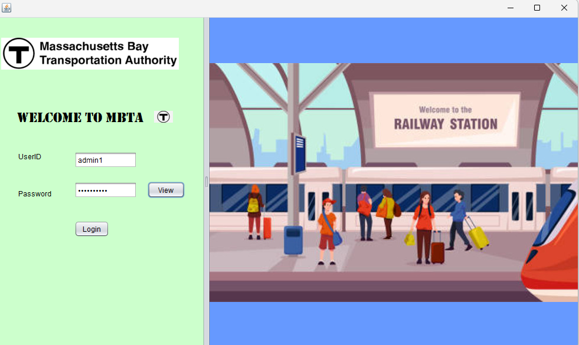
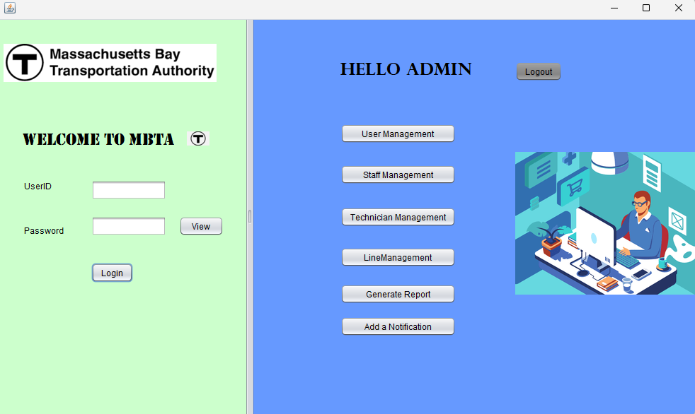
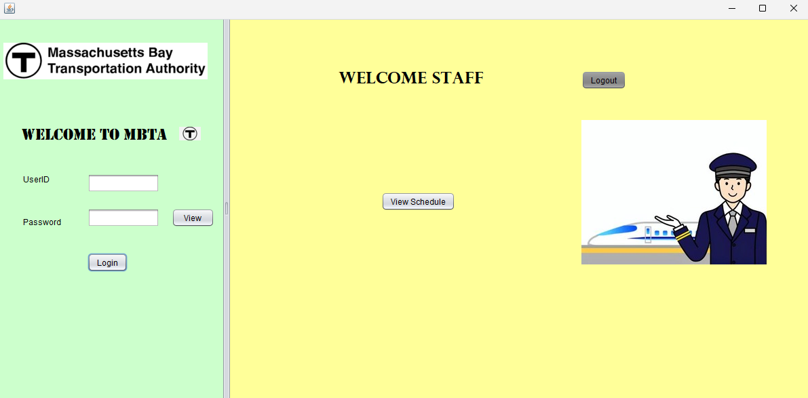
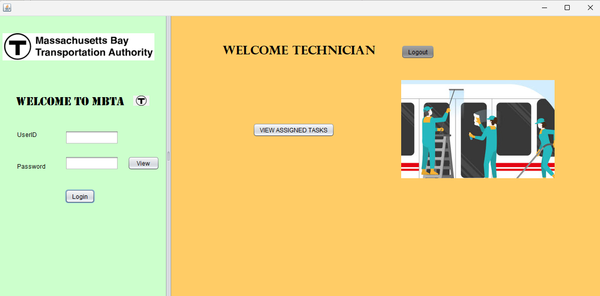
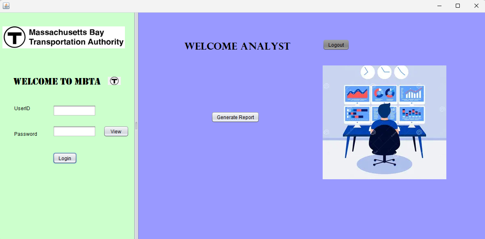
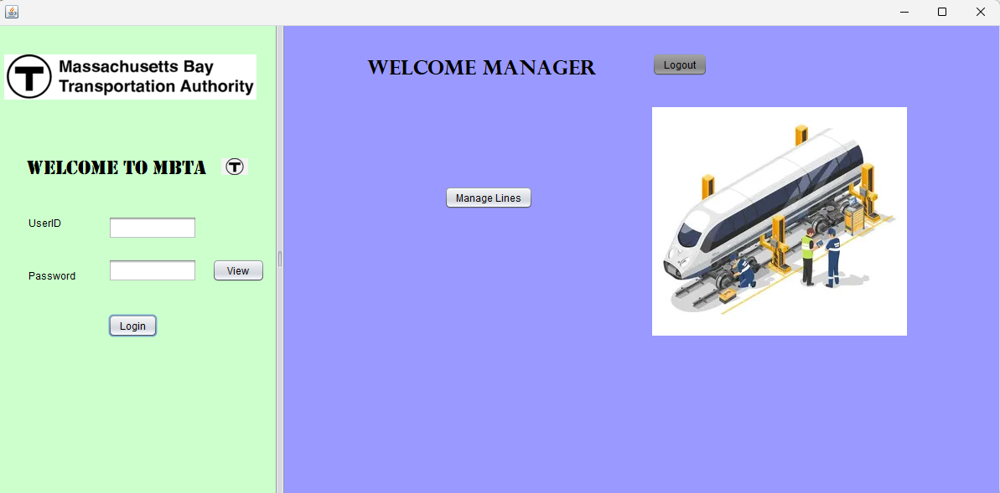
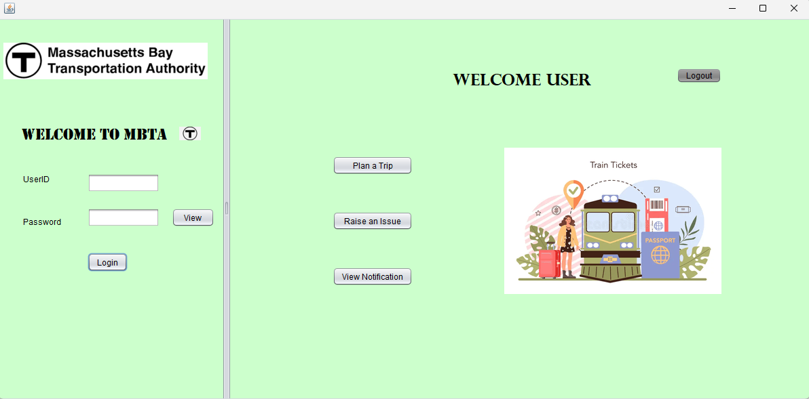

# MBTA Commuter System Application

## Overview

The MBTA Commuter System is a Java Swing desktop application that simulates a real-world commuter management platform for the Massachusetts Bay Transportation Authority (MBTA). The application manages users, issues, complaints, lines, notifications, and reports while enforcing role-based access control with user authentication.

## Features

### User Authentication
- **Login Screen:**  
  Users log in with a username and password. The system authenticates credentials using the `UserDirectory` and `PersonDirectory` and routes users to the appropriate dashboard based on their role.

### Role-Based Access Control
- **Admin:**  
  - Create, update, and delete users.
  - Manage staff and technician profiles.
  - Manage lines (view, edit, assign staff).
  - Generate comprehensive system reports.
  - Post and manage notifications.
  
- **Staff:**  
  - Raise issues (e.g., report operational problems).
  - View their schedules and assigned lines.
  
- **Technician:**  
  - View assigned issues/tasks.
  - Update issue statuses (e.g., In Progress, Resolved, Closed).
  - Add resolution comments to issues.
  
- **Analyst:**  
  - Generate detailed reports on system performance.
  - Use a dropdown filter to display metrics by category (All, Lines, Issues, Technicians).
  
- **Customer Service Representative (CSR):**  
  - Manage customer complaints and feedback.
- **Line Manager:**  
  - Oversee Line management and coordinate between technicians and staff.
  
- **Customer:**  
  - Plan trips and raise issues/complaints.
  - View notifications about service alerts.
  

### Complaint and Issue Management
- **Complaint Management:**  
  Customers and users can submit complaints and feedback. Complaints are stored in the `ComplaintDirectory` and are accessible by CSR personnel.
- **Issue Management:**  
  - Issues can be raised by staff or customers.
  - Issues are tracked with statuses such as Open, Assigned, In Progress, Resolved, and Closed.
  - Technicians can update issue statuses and add resolution notes.

### Line Management
- **Line Details:**  
  Lines (routes) are managed with details like line name, start station, end station, and status.
- **Assignment:**  
  Staff may be assigned to specific lines, and line managers can view and edit these assignments.

### Report Generation
- **Aggregated Reports:**  
  The system generates reports that combine metrics on lines, issues, and technician performance.
- **Dropdown Filter:**  
  A dropdown selector allows users to filter the report by category (All, Lines, Issues, Technicians). When a category is selected, only the relevant metrics are displayed.

### Notification Management
- **System Notifications:**  
  The application supports notifications (e.g., service alerts, station closures) that are displayed in a dedicated panel. Users can view detailed notifications by double-clicking a row.

## Application Workflow

1. **Login:**  
   - Users enter their credentials on the login screen.
   - Upon successful authentication, users are routed to their role-specific dashboard (Admin, Staff, Technician, Analyst, CSR, Issue Manager, or Customer).

2. **Admin Functions:**  
   - **User Management:** Create, update, and delete user accounts.
   - **Staff/Technician Management:** Manage profiles and assign roles.
   - **Line Management:** View and edit line details; assign staff to lines.
   - **Report Generation:** Use a dropdown filter to view specific categories of reports.
   - **Notification Management:** Add and manage system notifications.

3. **Staff Functions:**  
   - Raise new issues regarding service problems.
   - View their schedule and assigned lines.

4. **Technician Functions:**  
   - View assigned issues.
   - Update issue statuses and add resolution comments.
   - Mark issues as In Progress, Resolved, or Closed.

5. **Analyst Functions:**  
   - Generate and view comprehensive reports.
   - Filter reports by category to focus on lines, issues, or technician performance.

6. **CSR Functions:**  
   - Manage customer complaints and provide feedback responses.

7. **Customer Functions:**  
   - Plan trips and raise issues or complaints.
   - View notifications about service alerts.

## Report Filter Functionality

The report panel includes a dropdown filter that allows users to select a report category:
- **All:** Displays all available metrics.
- **Lines:** Displays metrics related to lines (e.g., total lines, operational lines).
- **Issues:** Displays metrics related to issues (e.g., total issues, open issues).
- **Technicians:** Displays metrics related to technicians (e.g., total technicians, most assigned technician).

When a category is selected, only the relevant report data is shown in the table.

---