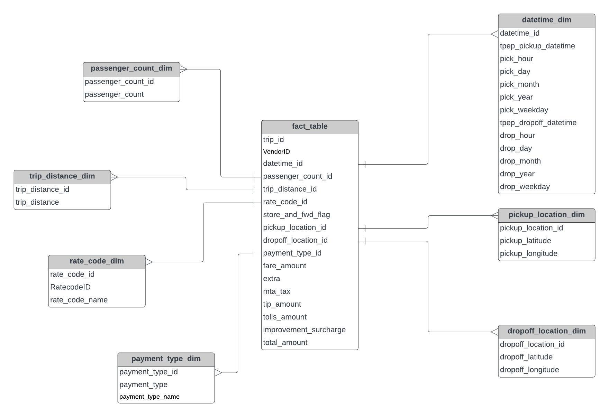

# Uber Trip Data: End-to-End Modern Data Engineering Pipeline

This project demonstrates how to build and deploy an end-to-end data engineering pipeline for Uber-like trip data using modern tools including Mage, Google Cloud Platform (GCP), BigQuery, and Looker Studio. The goal is to extract, transform, load (ETL), and visualize insights from large-scale ride data to support operational decision-making.

---

##  Project Problem & Objectives

Traditional static data pipelines often lack scalability and observability for real-time analytics. This project addresses those challenges using a modular cloud-based stack:

**Objectives:**
- Ingest structured trip data using modern pipeline orchestration
- Perform transformation and validation using Python and Mage
- Load data into BigQuery for large-scale querying
- Visualize insights using Looker Studio dashboards

---

##  Architecture

The data engineering pipeline includes:
- GCP Cloud Storage for data ingestion
- Mage (open-source orchestration) for pipeline automation
- BigQuery for scalable querying
- Looker Studio for BI reporting

_Architecture Diagram:_

---

##  Technologies Used

**Programming & Orchestration**
- Python
- Mage (https://www.mage.ai)

**Cloud Platform**
- Google Cloud Storage
- Compute Engine (VM)
- BigQuery
- Looker Studio

---

## Dataset
- Fields include pickup/dropoff times, locations, trip distance, fares, passenger count, etc.
- Source: NYC Taxi & Limousine Commission (TLC)  
  - [Dataset Info](https://www.nyc.gov/site/tlc/about/tlc-trip-record-data.page)  
  - [Data Dictionary](https://www.nyc.gov/assets/tlc/downloads/pdf/data_dictionary_trip_records_yellow.pdf)

---

##  Data Model

The cleaned and transformed data is structured into fact and dimension tables in BigQuery, optimized for analytical queries.

_Example Data Schema Diagram:_

